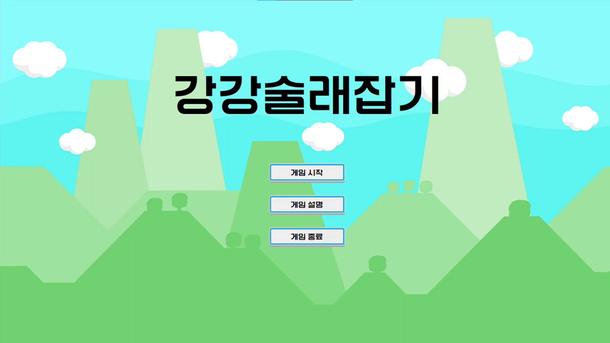

# 강강술래잡기
   
* 기간 : 2023.11.20 ~ 2023.12.15
* 인원 : 2인 (프로그래밍 2명)
* 개발 툴, 언어 : C++(Win32API)
* 플랫폼 : PC

## 팀원 소개
|팀원|직군|작업 내용|
|:---:|:---:|:---:|
|임준성|팀장, 프로그래머|픽셀 콜리젼 구현, 환경 변화 구현, 스테이지 기믹 구현|
|강민성|프로그래머|플레이어 구현, 카메라 쉐이크 등의 효과 구현|

## 게임 소개
강강술래잡기는 하나의 컴퓨터로 친구와 둘이서 즐기는 술래잡기 게임입니다.  
포탈, 점프대와 중력 반전, 입력 반전 등의 환경 변화요소들을 통해 단순하게 술래잡기를 하기 보단 여러 요소를 이용하여 게임을 더욱 풍성하게 즐길 수 있도록 하였습니다.  
친구와 짧은 시간 간단하게 즐길 수 있는 게임을 만들고자 제작하게 되었습니다.  
